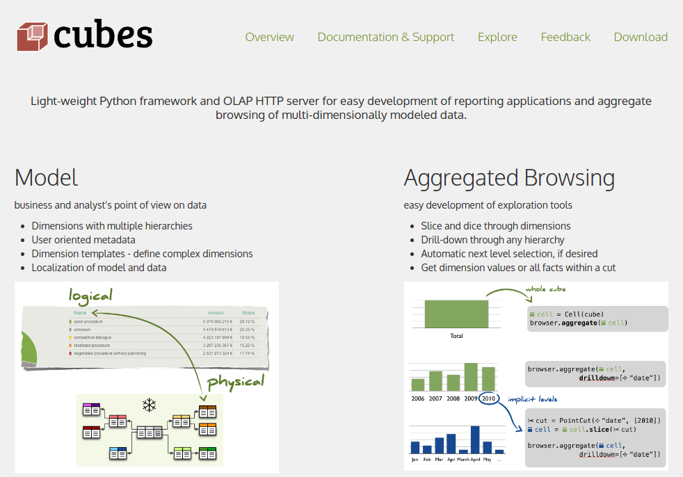

% OLAP data analysis and visualization with Cubes and CubesViewer
% {height=40 style=vertical-align:middle} jjmontes@gmail.com - {height=40 style=vertical-align:middle} jjmontesl
% PyDay Galicia 2017 (*CC BY-SA 3.0*)


## Agenda

* Business Intelligence and OLAP
* Cubes (Simple Python OLAP server)
* Cubes Examples
* Visualization with CubesViewer

# Business Intelligence and OLAP

## Business Intelligence

<div style="font-size: 80%">
BI comprises the set of strategies, processes, applications, data, technologies
and technical architectures which are used by enterprises to
support the collection, data analysis, presentation and dissemination of
business information.
</div>

* ETL (extract, transform and load)
* Data warehousing (storage, accessibility, performance)
* Data mining (querying, visualization... obtaining meaningful results)
* Machine learning (*lately*)

## Online Analytical Processing (OLAP)

**OLAP** is an approach to answering multi-dimensional analytical (MDA) queries in computing.
It is typically contrasted to *OLTP*.

OLAP tools enable users to analyze multidimensional data interactively from multiple
perspectives. Databases configured for OLAP use a **multidimensional data model**, allowing for
complex analytical and ad hoc queries with a **rapid execution time**.

## Multidimensional Data Model


---


* Facts (with measures)
* Dimensions (with discrete values)

---

**Dimension Hierarchies**


---

**Multidimensional cube**


> Not all cells contain the same number of facts. Some may be empty.

## OLAP Operations

OLAP consists of three basic analytical operations:

* Consolidation (roll-up)
* Drill-down
* Slicing and dicing

---


**Consolidation** involves *aggregating* fact *measures* appropriately (average, sum...).

---


**Drill-down** is the ability to provide separate results over one or
more *dimensions*.

---


**Slicing and dicing** is the ability to select only *slices* of a dimension,
meaning *filtering* a set of values we are interested in.

---


## ROLAP

ROLAP refers to the technologies that perform OLAP operations over a
relational (SQL) backend.

For performance, a particular relational schema is used. Dimensions are
splitted into separate tables:

* Fact tables
* Dimension tables

---


**Star Schema**

---


**Snowflake Schema**


## Attributes

Facts and dimensions can have several attributes, stored along them
in the same tables.

These are used during visualization and reporting (some engines also support
filtering over attributes, but may be slower or impossible).

Attributes can include references to icons, human-readable formats, extra
data for filtering or presentation (full addresses, complete names), references
to primary keys in foreign databases.

## ETL

Retrieving data from multiple sources and storing it in a format
that supports analysis operations.

* **Data extraction** is where data is extracted from homogeneous or heterogeneous data sources
* **Data transformation** where the data is transformed for storing in the proper format or structure for the purposes of querying and analysis
* **Data loading** where the data is loaded into the final target database, more specifically, an operational data store, data mart, or data warehouse.

# Cubes

## Cubes

Cubes is a simple open source OLAP server written in Python.

* Can be used from Python.
* Provides a HTTP server and query API.
* Supports a SQL backend (ROLAP).
* Supports normalized (star/snowflake) and also denormalized ROLAP schemas.

---



## Cubes Concepts


# Cubes Example

## Installing

Using PIP:

```
python3 -m venv env
. env/bin/activate
pip install cubes[slicer,sql]
```

Cubes works in both Python 2.7 and 3.x.

## Example dataset

We'll use an example dataset:

```bash
git clone https://github.com/jjmontesl/cubes-examples
```

The database is in the `webshop.sqlite` file.

---


---

```sql
CREATE TABLE dates (
    id VARCHAR(128) NOT NULL,
    year INTEGER,
    quarter INTEGER,
    month INTEGER,
    week INTEGER,
    day INTEGER,
    dow VARCHAR(128),
    PRIMARY KEY (id)
);
CREATE TABLE customer (
    id INTEGER NOT NULL,
    name VARCHAR(128),
    PRIMARY KEY (id)
);
CREATE TABLE product (
    id INTEGER NOT NULL,
    category_label VARCHAR(128),
    product_label VARCHAR(128),
    PRIMARY KEY (id)
);
CREATE TABLE country (
    continent_code VARCHAR(128),
    continent_name VARCHAR(128),
    country_code VARCHAR(128) NOT NULL,
    country_name VARCHAR(128),
    PRIMARY KEY (country_code)
);
CREATE TABLE webshop_sales (
    id INTEGER NOT NULL,
    date_sale_id VARCHAR(128),
    customer_id INTEGER,
    product_id INTEGER,
    country_id VARCHAR(128),
    quantity INTEGER,
    price_total FLOAT,
    delivery_days INTEGER,
    PRIMARY KEY (id)
);
```

## Configuring the data model

Model defined in `model.json` file.

<div style="float: left; width: 49%;">
**Model**

* Cubes
* Measures
* Aggregates
* Dimensions
</div>

<div style="float: right; width: 49%;">
**Database**

* Joins
* Mappings
</div>

---

**Measures (per cube)**

```json
            "measures": [
                {
                    "label": "Quantity",
                    "name": "quantity"
                },
                {
                    "label": "Price Total",
                    "name": "price_total"
                },
                {
                    "label": "Delivery Days",
                    "name": "delivery_days"
                }
            ],
```

---

**Aggregates (per cube)**

```json
            "aggregates": [
                {
                    "function": "sum",
                    "label": "Quantity Sum",
                    "measure": "quantity",
                    "name": "quantity_sum"
                },
                {
                    "function": "avg",
                    "label": "Quantity Avg",
                    "measure": "quantity",
                    "name": "quantity_avg"
                },
                {
                    "function": "sum",
                    "label": "Price Total Sum",
                    "measure": "price_total",
                    "name": "price_total_sum"
                },
                ...
            ]
```

---

**Dimensions (per cube)**

```json
            "dimensions": [
                "date_sale",
                "customer",
                "product",
                "country"
            ],
```

---

**Dimension definition (global)**

```json
        {
            "name": "product"
            "label": "Product",
            "hierarchies": [
                {
                    "label": "Product",
                    "levels": [
                        "product_category",
                        "product_product"
                    ],
                    "name": "product"
                }
            ],
            "levels": [
                {
                    "attributes": [
                        "category_label"
                    ],
                    "key": "category_label",
                    "label": "Product Category",
                    "label_attribute": "category_label",
                    "name": "product_category"
                },
                {
                    "attributes": [
                        "product_label"
                    ],
                    "key": "product_label",
                    "label": "Product",
                    "label_attribute": "product_label",
                    "name": "product_product"
                }
            ],
        },
```

---

**Joins (per cube)**

```json
            "joins": [
                {
                    "alias": "country",
                    "detail": "country.country_code",
                    "master": "webshop_sales.country_id"
                },
                {
                    "alias": "product",
                    "detail": "product.id",
                    "master": "webshop_sales.product_id"
                },
                {
                    "alias": "customer",
                    "detail": "customer.id",
                    "master": "webshop_sales.customer_id"
                },
                {
                    "alias": "date_sale",
                    "detail": "dates.id",
                    "master": "webshop_sales.date_sale_id"
                }
            ],
```

---

**Mappings (per cube)**

```json
            "key": "id",
            "mappings": {
                "country.continent_code": "country.continent_code",
                "country.continent_name": "country.continent_name",
                "country.country_code": "country.country_code",
                "country.country_name": "country.country_name",
                "customer.id": "customer.id",
                "customer.name": "customer.name",
                "date_sale.day": "date_sale.day",
                "date_sale.dow": "date_sale.dow",
                "date_sale.id": "date_sale.id",
                "date_sale.month": "date_sale.month",
                "date_sale.quarter": "date_sale.quarter",
                "date_sale.week": "date_sale.week",
                "date_sale.year": "date_sale.year",
                "product.category_label": "product.category_label",
                "product.id": "product.id",
                "product.product_label": "product.product_label"
            },
```

## Cubes deployment

* Slicer server instance (HTTP GET requests)
* Slicer WSGI app (Flask app)
* Flask blueprint (register slicer as part of a Flask app)
* Cubes API access from Python

---


## Configuring the server

Configuration is usually called `slicer.ini`.

```
[workspace]
log_level: debug

[server]
host: localhost
port: 5000
reload: yes
prettyprint: yes
json_record_limit: 5000
allow_cors_origin: *
processes: 6

[store]
type: sql
url: sqlite:///webshop.sqlite

[models]
main: model.json
```

## Running

Using the `slicer` server:

    . env/bin/activate
    slicer serve slicer.ini

Test connecting to:

[http://localhost:5000/](http://localhost:5000/)

## Querying

**Aggregate**

[/cube/webshop_sales/aggregate](http://localhost:5000/cube/webshop_sales/aggregate)

**Drill down**

[/cube/webshop_sales/aggregate?drilldown=product@product:product_category](http://localhost:5000/cube/webshop_sales/aggregate?drilldown=product%40product%3Aproduct_category)

**Filter**

[/cube/webshop_sales/aggregate?cut=product@product:Books](http://localhost:5000/cube/webshop_sales/aggregate?cut=product%40product%3ABooks)

---

**Facts**

[/cube/webshop_sales/facts](http://localhost:5000/cube/webshop_sales/facts)

> Not all backends can provide raw facts, they may have been preaggregated.

**Model**

[/cube/webshop_sales/model](http://localhost:5000/cube/webshop_sales/model)

## Using Cubes API

```python
from cubes import Workspace, Cell, PointCut

# 1. Create a workspace
workspace = Workspace()
workspace.register_default_store("sql", url="sqlite:///webshop/webshop.sqlite")
workspace.import_model("webshop/model.json")

# 2. Get a browser
browser = workspace.browser("webshop_sales")

# 3. Play with aggregates
result = browser.aggregate()
print("Record count: %8d" % result.summary["record_count"])
print("Price sum:    %8d" % result.summary["price_total_sum"])
print("Items sum:    %8d" % result.summary["quantity_sum"])
```

# Visualization with CubesViewer

## CubesViewer

**CubesViewer** is a HTML5 data visualization tool that uses Cubes as backend.


## Downloading CubesViewer

Using git:

    git clone https://github.com/jjmontesl/cubesviewer.git

Or get packages from:

[http://www.cubesviewer.com](http://www.cubesviewer.com)

## Visualizing the example

CubesViewer can be loaded simply by pointing the browser at:

[file:///cubesviewer-path/html/studio.html]()

## Another example...

{height=300}

*A server side app is also available: `cubesviewer-server`.*


# Closing up

## Landscape

* OLAP/BI in other languages: [Pentaho](http://www.pentaho.com/), MSBI
* Lower level data tools in Python: [Pandas](http://pandas.pydata.org/), SQLAlchemy, NumPy
* Reporting: BIRT, Jasper, Pentaho, [SSRS](https://msdn.microsoft.com/es-es/library/ms159106.aspx)
* Analytic servers: [Cubes](http://cubes.databrewery.org/), [ElasticSearch](https://www.elastic.co/), [Cassandra](http://cassandra.apache.org/), MSAS, noSQL
* Visualization tools: [Kibana](https://www.elastic.co/products/kibana), [Superset](https://github.com/airbnb/superset)... [d3.js](https://d3js.org/), [CubesViewer](CubesViewer)
* Common SaaS: Qlik, Datadog, Firebase, Google Analytics...
* Standards: MDX, Google Dataset

...and a myriad of custom solutions.

<aside class="notes">
    Analytic servers may be able to do pre-aggregation. Cassandra and ElasticSearch can do preaggregation.
    noSQL backends can also support OLAP (map/reduce is a model that suits OLAP).
</aside>

## Future...

* The BI landscape in Python is scarce.

* Cubes needs a new revision.
* Focus for 2.0 is on better data modelling.

## References

* [Cubes](http://cubes.databrewery.org/) ([GitHub](https://github.com/DataBrewery/cubes))
* [CubesViewer](http://www.cubesviewer.com/) ([GitHub](https://github.com/jjmontesl/cubesviewer))

* Star Schema The Complete Reference - Christopher Adamson - McGraw Hill 2010
* [Business Intelligence](https://en.wikipedia.org/wiki/Business_intelligence)
* [Online_analytical_processing](https://en.wikipedia.org/wiki/Online_analytical_processing)
* [Extract, transform, load](https://en.wikipedia.org/wiki/Extract,_transform,_load)
* [Star Schema](https://en.wikipedia.org/wiki/Star_schema)

## Q&A ?

Thanks!


